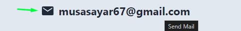
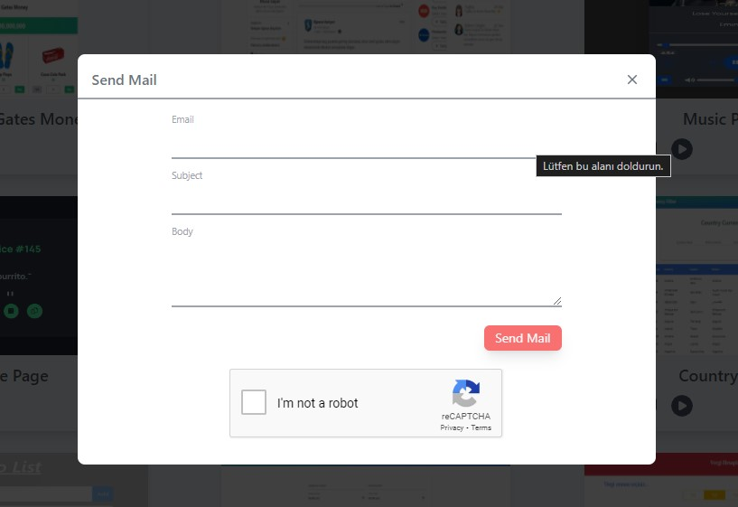
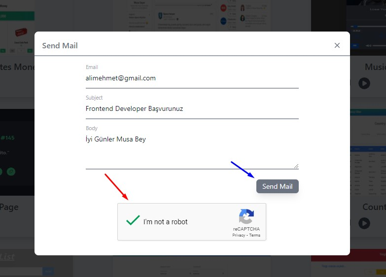

https://github.com/musayar9/my-portfolio-project/assets/96313325/f91b71b4-4644-4745-aa3a-97eafd788a88

## Portfolyo Sayfam - [Projeyi Görüntüle](https://my-portfolio-project-two-sigma.vercel.app/)

Bu projede kendimi tanıtan bir portfolyo sayfası yaptıldı. Bu sayfada benim github ve medium hesabımda yayınlamış olduğum projelerimin ve makalelerimin ön tanıtımları yer almaktadır.

Proje react ve redux toolkit kullanılarak yapıldı. Proje tasarımında ise tailwindcss kullanıldı. Proje responsive yapıda tasarlandı. Projedeki veriler için contentful platformu kullanıldı veriler bu platform üzerinden çekildi. İletişim için bir mail gönderme formu oluşturuldu. Bu formun güvenliği içinde recaptcha kullandıldı.

## Proje Özellikleri

#### Tanıtım

Proje de ilk başta bir kendimi tanıtan bir önyazı bulunmkata. Önyazı altında 3 tane ikon bulunmakta bu ikonlar;

**Github:** Github ikonuna tıkladığında benim github profilime yönlendirileceksiniz;

**LinkedIn:** Linkedın ikonuna tıkladığında benim linkedIn profilime yönlendirileceksiniz;

**Medium:** Medium ikonuna tıkladığında benim Medium profilime yönledirileceksiniz.

Ekranın sağ tarafında resmin altında (_Cv Download_) butonuna tıkladığınızda is _CV'imi_ görüntüleyecekisiniz.

#### Yetkinlikler

Yukaridaki resimde ise bildiğim teknolojiler ve programa dilleri yer almakta.

## Sayfalar

Github projlerimin ve medium yazılarımın olduğu iki farklı sayfa oluşturduk. Ekranın sağ tarafında Projects'ler ve Articles adında iki farklı link bulunmakta projects linkine tıklandığınızda github projelerimin olduğu sayfaya yönlendirileceksiniz. Articles linkine tıklandığınız da ise medium yazılarıma yönledirileceksiniz

|  |  |
| -------------------------- | -------------------------- |

## Projeler

Bu alanda html5, css, javascript, react ve nodeJs teknolojilerini kullanarak yaptığım projeler bulunmaktadır.

|  |  |
| -------------------------- | -------------------------- |

Yukarıda sol tarafataki resimde kırmızı okla gösterilen github ikonuna tıkladığınızda igili projenin githup reposuna yönlendirileceksiniz.

|  |  |
| -------------------------- | -------------------------- |

Yukarıda sol tarafataki resimde resimde mavi okla gösterilen ekran ikonuna tıkladığınız da projenin demosunun bulunduğu sayfaya yönlendirileceksiniz.

|  |  |
| ---------------------------- | ---------------------------- |

Yukarıda sol tarafataki resimde yeşil okla gösterilen play ikonuna tıkladığınızda projenin canlı demosunun videosunu izleyebileceksiniz.

## Articles (Makaleler)

Bu sayfada ise medium platformu üzerinde yayınlamış olduğum makaleler bulunmaktadır.

|  |  |
| ---------------------------- | ---------------------------- |

Sayfada bulunan makalelerden herhangi birinin üzerine fare ile geldiğinizde ilgili makalenin kısa tanıtımını görüntüleyeceksiniz. Makalenin üstün tıkladığınız da ise ilgili makalenin bulunduğu medium sayfasına yönlendirileceksiniz.

## Email Gönderimi

|  |  |  |
| ---------------------------- | ---------------------------- | ---------------------------- |

Yukarıda sol tarafaki resimlerde mavi ve yeşil okla gösterilen mesaj ikonuna veya email-adresine tıkladığınızda ekranda modal içinde form alanı açılacak.

Açılan form alanında istenillen input alanlarını doldurduktan sonra emaili gönderebilmek için recapctha üzerinden size yöneltilen soruya cevap verdikten sonra mail gönder (sendMail) butonu aktif olacak. Butona tıkladıktan sonra size mailinizin gönderildiğine dair bir bildirim yazısı gösterilecek.

