## Portfolyo Sayfam  [Porjeyi Görüntüle](https://musasayar-portfolio.netlify.app/)

Bu projemde kendimi tanıtan bir portfolyo sayfası yaptım. Bu sayfada benim github ve medium hesabımda yayınlamış olduğum projelerimin ve makaleleimin ön tantımları yer almakta.

Proje de javascriptin react kütüphanesini kullandık. State yönetimini redux toolkit ile yaptık. Proje tasarımında ise tailwindcss kullandık Porje responsive yapıda tasarlandı. Projemdeki verileri contentfulApi üzerinde tutuk bu verileri bu api üzerinden çektik. Emailjs kütüphanesini kullanarak bir mail gönderme formu oluşturduk. Bu formun güvenliği içinde recaptcha kullandık.

## Proje Özellikleri

#### Tanıtım

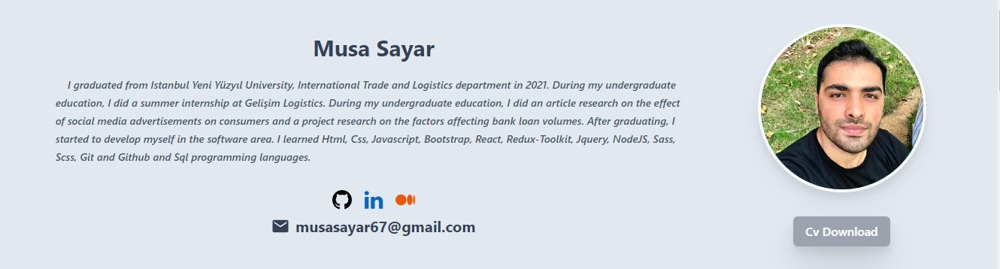

Proje de ilk başta kedimi tantan kısa bir yazı bulunmakta. Tanıtımın altında 3 tane ikon bulunmakta bu ikonlar;

**Github İkonu:** Github ikonuna tıkladığında benim github profilime yönlendirileceksiniz;

**LinkedIn İkonu:** Linkedın ikonuna tıkladığında benim linkedIn profilime yönlendirileceksiniz;

**Medium İkonu:** Medium ikonuna tıkladığında benim Medium profilime yönledirileceksiniz.

Ekranın sağ tarafında resmin altında (_Cv Download_) butonuna tıkladığınızda _CV'imi_ görüntüleyecekisiniz.

#### Yetkinlikler

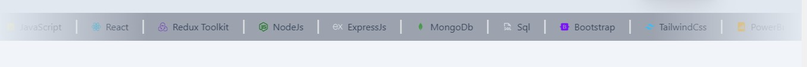

Yukaridaki resimde ise bildiğim teknolojiler ve programa dilleri yer almakta.

## Sayfalar

Github projlerimin ve medium yazılarımın olduğu iki farklı sayfa oluşturduk. Ekranın sağ tarafında Projects'ler ve Articles adında iki farklı link bulunmakta projects linkine tıklandğında github projelerimin olduğu sayfaya yönlendirileceksiniz. Articles linkine tıklandığında ise medium yazılarıma yönledirileceksiniz

| 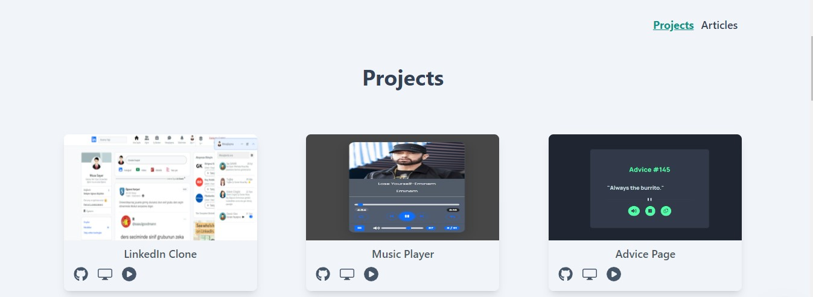 | 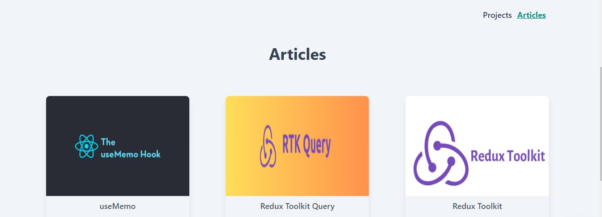 |
| -------------------------- | -------------------------- |

## Projeler

Bu alanda html5, css, javascript, react ve nodeJs teknolojilerini kullanarak yaptığım projeler bulunmaktadır.

| 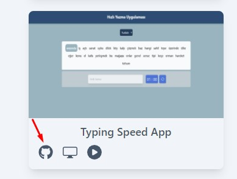 | 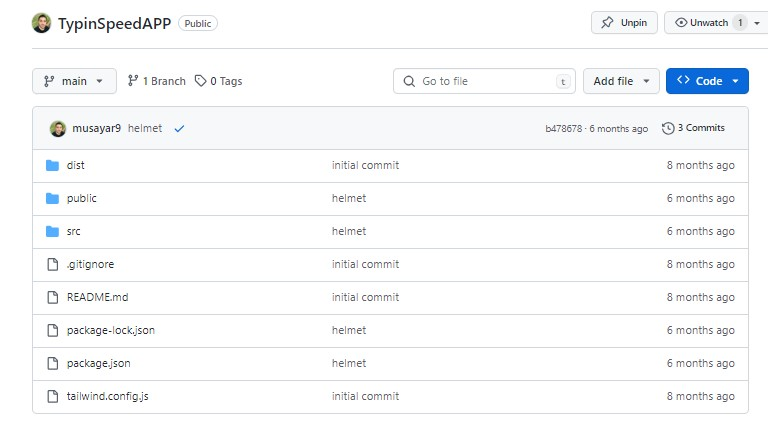 |
| -------------------------- | -------------------------- |

Yukarıda sol tarafataki resimde kırmızı okla gösterilen github ikonuna tıkladığınızda igili projenin githup reposuna yönlendirileceksiniz.

| 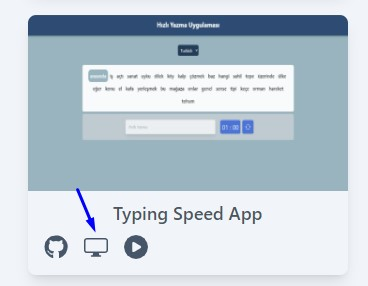 | 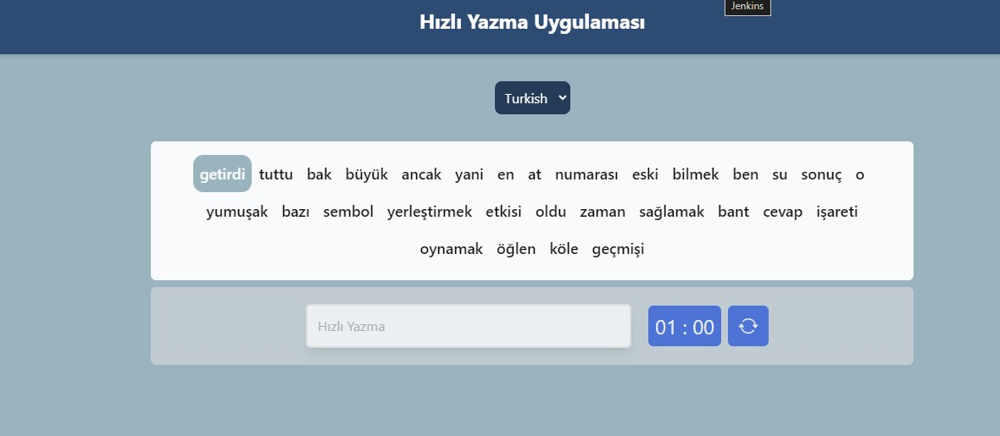 |
| -------------------------- | -------------------------- |

Yukarıda sol tarafataki resimde resimde mavi okla gösterilen ekran ikonuna tıkladığınız da projenin demosunun bulunduğu sayfaya yönlendirileceksiniz.

| 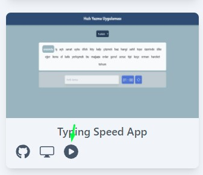 | 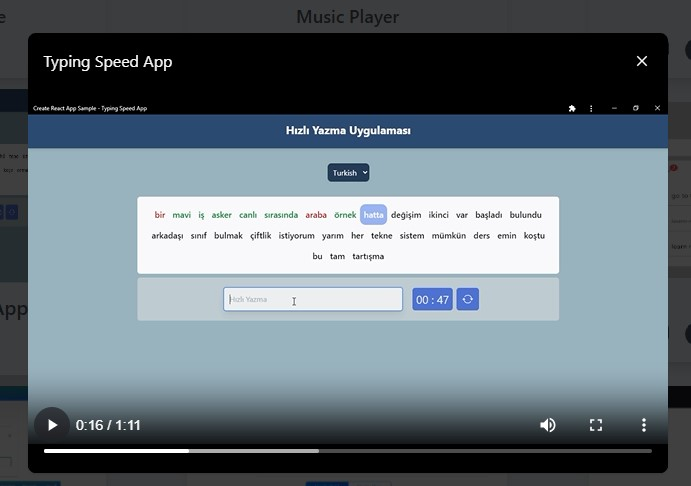 |
| ---------------------------- | ---------------------------- |

Yukarıda sol tarafataki resimde yeşil okla gösterilen play ikonuna tıkladığınızda projenin canlı demosunun videosunu izleyebileiceksiniz.

## Articles (Makaleler)

Bu sayfada ise medium platformu üzerinde yayınlamış olduğumuz makaleler bulunmaktadır.

| 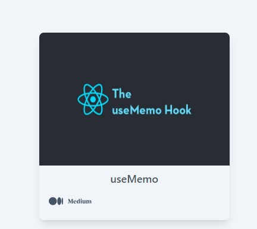 | 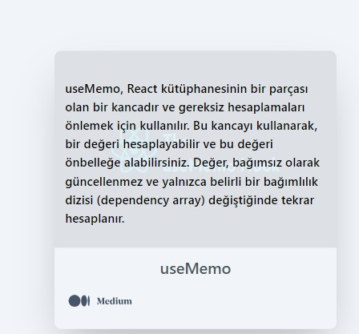 |
| ---------------------------- | ---------------------------- |

Sayfada bulunan makalelerden herhangi birinin üzerine fare ile geldiğinizde ilgili makalenin kısa tanıtımını görüntüleyeceksiniz. Makalenin üstünde tıkladığınız da ise ilgili makalenin bulunduğu medium sayfasına yönlendirileceksiniz.

## Email Gönderimi

| 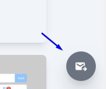 | 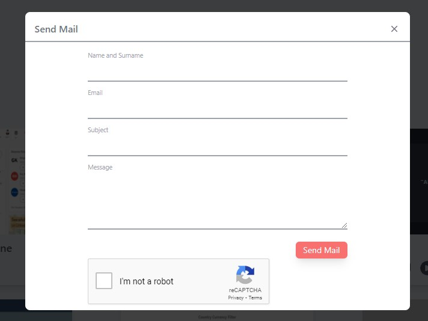 |
| ---------------------------- | ---------------------------- |

Yukarıda sol tarafaki resimde mavi okla gösterilen mesaj ikonuna tıkladığınızda ekranda bir modal sayfası içinde bir form alanı açılacak.

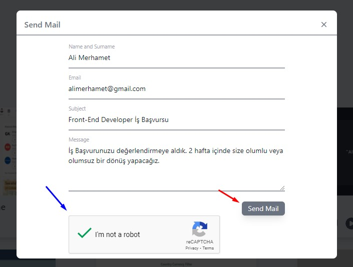

Açılan form sayfası üzerinden ilgili alanları doldurduktan sonra maili gönderebilmek için recapctha üzerinden size yöneltilen soruya cevap verdikten sonra mail gönder (sendMail) butonu aktif olacak. Butona tıkladıktan sonra size mailinizin gönderildiğinie dair bir bildirim yazısı gösterilecek.

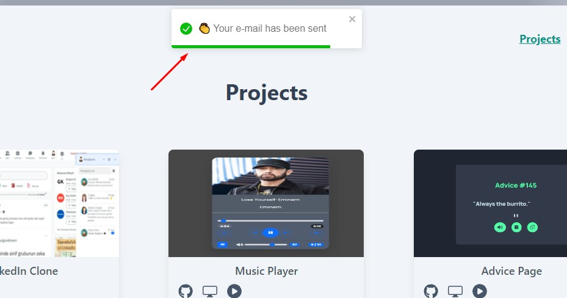
